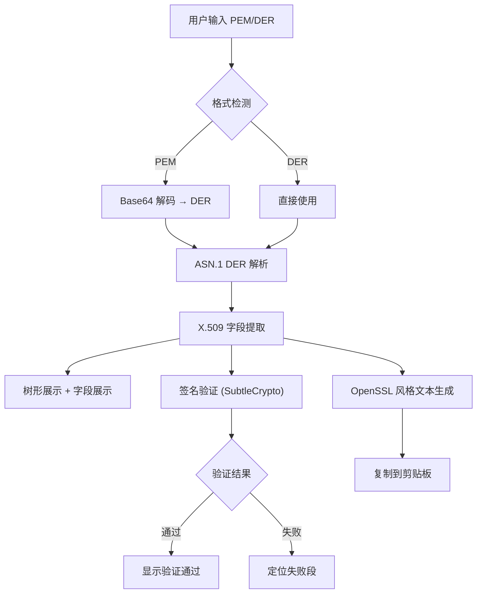
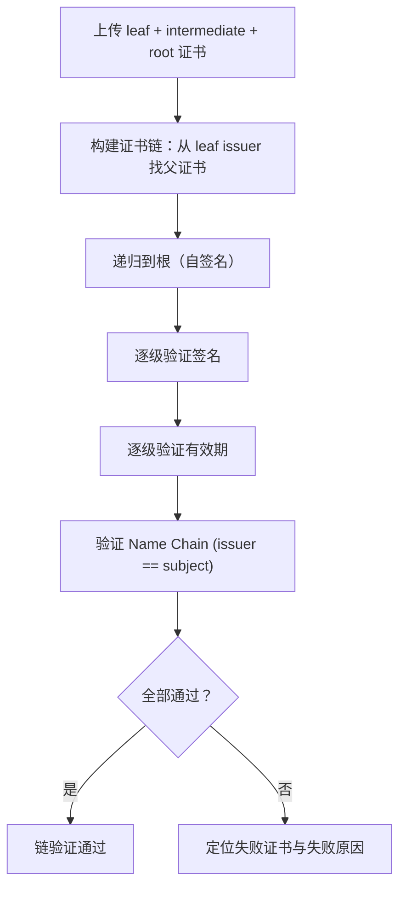

## 1. 产品概述

浏览器内 X.509 证书解析与验证工具——零后端，本地完成 ASN.1 DER 解析、X.509 字段树形展示、证书链验证与签名校验，输出格式可与 `openssl x509 -text` 直接对比。

- 目标用户：安全工程师、运维人员、开发者，需要快速解析和验证证书而无需安装 OpenSSL
- 核心价值：浏览器即完成证书全链路分析，无需后端服务，数据不离开本地

## 2. 核心功能

### 2.1 功能模块

1. **证书输入页**：PEM 粘贴 / 文件拖拽（.pem / .cer / .crt），自动识别 PEM 与 DER 格式
2. **ASN.1 解析视图**：tag / length / value 树形展示，可展开折叠
3. **X.509 字段视图**：版本 / 序列号 / 签名算法 / 颁发者 / 有效期 / 主题 / SAN / 扩展（Key Usage、EKU、AKI、SKI、CRL DP）
4. **链验证面板**：上传中间 + 根证书，验证签名链 + 有效期 + Name Chain，逐级结果展示
5. **OpenSSL 风格导出**：一键复制与 `openssl x509 -text -noout` 字段顺序一致的文本

### 2.2 页面详情

| 页面名称 | 模块名称 | 功能描述 |
|----------|----------|----------|
| 主页面 | 证书输入区 | 粘贴 PEM 或拖拽文件上传，支持多证书批量识别 |
| 主页面 | ASN.1 树 | DER 编码 tag/length/value 树形展示，含偏移量与十六进制 |
| 主页面 | X.509 字段 | 解析后字段结构化展示，OID 自动翻译 |
| 主页面 | 链验证 | 上传中间/根证书，递归验证签名链，逐级显示结果 |
| 主页面 | OpenSSL 导出 | 生成 OpenSSL 风格文本，一键复制 |

## 3. 核心流程

链验证流程：

## 4. 用户界面设计

### 4.1 设计风格

- **主题**：工业/终端风（深色背景 + 绿色/琥珀色高亮），呼应密码学/安全工具的极客气质
- **主色**：深灰黑 (#0d1117) 背景，翡翠绿 (#10b981) 作为成功/主操作色，琥珀色 (#f59e0b) 作为警告色，红色 (#ef4444) 作为错误色
- **字体**：JetBrains Mono（代码/数据区）+ Inter（UI 文案），体现技术与可读性平衡
- **按钮**：圆角小按钮，hover 微动效，主要操作用实色填充
- **布局**：左侧输入面板 + 右侧 Tab 切换（ASN.1 树 / X.509 字段 / 链验证 / OpenSSL 导出）
- **图标**：lucide-react 线性图标

### 4.2 页面设计概览

| 页面名称 | 模块名称 | UI 元素 |
|----------|----------|---------|
| 主页面 | 证书输入区 | 深色文本域 + 虚线拖拽区 + 文件按钮 |
| 主页面 | ASN.1 树 | 缩进树形列表，tag 色彩编码，可折叠节点 |
| 主页面 | X.509 字段 | 键值对列表，OID 翻译，时间格式化 |
| 主页面 | 链验证 | 证书链垂直时间线，每级绿/红状态标识 |
| 主页面 | OpenSSL 导出 | 等宽文本区 + 复制按钮 |

### 4.3 响应式

- 桌面优先（1280px+），左右分栏
- 平板（768-1280px），上下堆叠
- 手机（<768px），全宽单列
