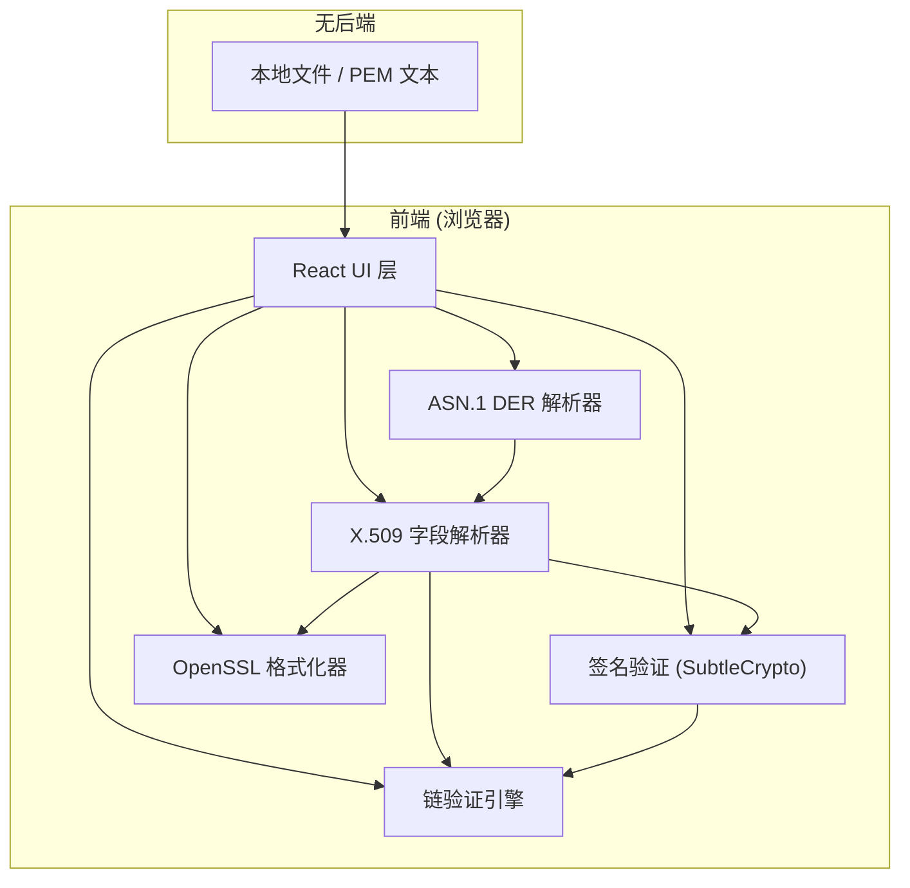

## 1. 架构设计



## 2. 技术说明

- **前端框架**：React@18 + TypeScript + Vite
- **样式方案**：TailwindCSS@3
- **状态管理**：Zustand
- **图标**：lucide-react
- **后端**：无（纯前端，浏览器本地运行）
- **密码学**：Web Crypto API (SubtleCrypto)
- **ASN.1 解析**：自实现（禁用 asn1.js / pkijs 等第三方库）

## 3. 路由定义

| 路由 | 用途 |
|------|------|
| / | 主页面，包含证书输入、解析、验证、导出全部功能 |

单页应用，功能通过 Tab 切换而非路由。

## 4. 核心模块设计

### 4.1 ASN.1 DER 解析器 (`src/utils/asn1.ts`)

自实现 ASN.1 DER 解析，覆盖以下 tag 类型：
- SEQUENCE (0x30), SET (0x31)
- INTEGER (0x02), BIT STRING (0x03), OCTET STRING (0x04)
- OID (0x06)
- UTCTime (0x17), GeneralizedTime (0x18)
- UTF8String (0x0C), PrintableString (0x13), IA5String (0x16)
- NULL (0x05), BOOLEAN (0x01)
- CONTEXT-SPECIFIC tags (0xA0-0xA3, 0x80-0x83)

解析输出结构：
```typescript
interface ASN1Node {
  tag: number;
  tagClass: 'universal' | 'application' | 'context' | 'private';
  constructed: boolean;
  length: number;
  valueOffset: number;
  rawValue: Uint8Array;
  children?: ASN1Node[];
  parsedValue?: string;
}
```

### 4.2 OID 映射表 (`src/utils/oids.ts`)

内置常见 OID 映射：
- 签名算法：sha256WithRSAEncryption, sha384WithRSAEncryption, ecdsa-with-SHA256, ecdsa-with-SHA384
- 公钥算法：rsaEncryption, id-ecPublicKey
- 主题字段：commonName, organizationName, countryName, stateOrProvinceName, localityName
- 扩展：subjectAltName, keyUsage, extKeyUsage, authorityKeyIdentifier, subjectKeyIdentifier, cRLDistributionPoints
- EC 曲线：prime256v1, secp384r1

### 4.3 X.509 解析器 (`src/utils/x509.ts`)

基于 ASN.1 解析结果提取 X.509 字段：
- 版本（v1/v2/v3）
- 序列号（十六进制）
- 签名算法
- 颁发者 DN
- 有效期（notBefore / notAfter）
- 主题 DN
- 公钥信息（算法 + 参数）
- 扩展：Key Usage, EKU, SAN, AKI, SKI, CRL DP

### 4.4 签名验证 (`src/utils/verify.ts`)

使用 SubtleCrypto API：
- RSA-PKCS1v1.5：SHA-256 / SHA-384
- ECDSA：P-256 / P-384
- 流程：importKey (SPKI 格式) → verify (签名算法 + tbsCertificate + 签名值)

### 4.5 链验证 (`src/utils/chain.ts`)

- 构建证书链：从 leaf 的 issuer 匹配父证书的 subject
- 递归到自签名根证书
- 逐级验证：签名有效性 + 有效期 + Name Chain
- 失败定位：具体到哪一级证书、哪个验证步骤失败

### 4.6 OpenSSL 格式化器 (`src/utils/openssl-format.ts`)

按 `openssl x509 -text -noout` 字段顺序生成文本：
- Version / Serial Number
- Signature Algorithm
- Issuer / Validity / Subject
- Subject Public Key Info
- X509v3 Extensions
- Signature Algorithm (底部)

## 5. 数据模型

```typescript
interface Certificate {
  pem: string;
  der: Uint8Array;
  asn1: ASN1Node;
  x509: X509Fields;
  tbsRaw: Uint8Array;
  signatureRaw: Uint8Array;
  signatureAlgorithm: string;
}

interface X509Fields {
  version: number;
  serialNumber: string;
  signatureAlgorithm: { oid: string; name: string };
  issuer: DistinguishedName;
  validity: { notBefore: Date; notAfter: Date };
  subject: DistinguishedName;
  subjectPublicKeyInfo: { algorithm: string; key: JsonWebKey };
  extensions: Extension[];
}

interface ChainValidationResult {
  valid: boolean;
  chain: Certificate[];
  results: ChainStepResult[];
}

interface ChainStepResult {
  subject: string;
  issuer: string;
  signatureValid: boolean;
  nameChainValid: boolean;
  validityOk: boolean;
  error?: string;
}
```

## 6. 项目结构

```
src/
├── components/
│   ├── CertificateInput.tsx    # PEM 粘贴 + 文件拖拽
│   ├── ASN1Tree.tsx            # ASN.1 树形展示
│   ├── X509Fields.tsx          # X.509 字段展示
│   ├── ChainValidator.tsx      # 链验证面板
│   ├── OpenSSLExport.tsx       # OpenSSL 风格导出
│   └── TreeNode.tsx            # 通用树节点组件
├── hooks/
│   └── useCertificate.ts       # 证书解析状态管理
├── utils/
│   ├── asn1.ts                 # ASN.1 DER 解析器
│   ├── oids.ts                 # OID 映射表
│   ├── x509.ts                 # X.509 字段提取
│   ├── verify.ts               # SubtleCrypto 签名验证
│   ├── chain.ts                # 链验证引擎
│   └── openssl-format.ts       # OpenSSL 风格格式化
├── store/
│   └── certificateStore.ts     # Zustand 状态
├── App.tsx
└── main.tsx
```
